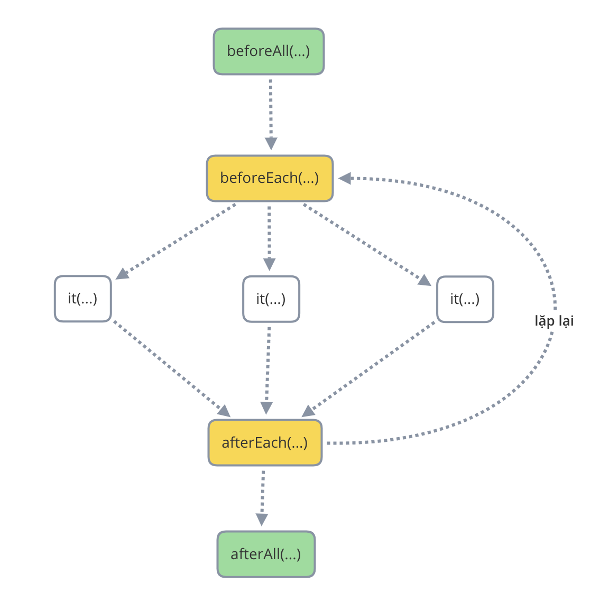

# Unit Testing trong Angular

> Nếu bạn chưa biết Unit Testing và những khái niệm cơ bản liên quan, hãy tìm đọc bài viết **Unit Test - Những bước chân đầu tiên** trong Tạp Chí Lập Trình Vol.4.

Kiểm thử giúp đảm bảo những thay đổi hoặc bổ sung không gây ảnh hưởng đến các tính năng cũ của ứng dụng hoặc phát sinh lỗi mới. Chúng ta tiếp tục tìm hiểu cách viết unit test cho các ứng dụng được xây dựng với framework Angular. Cụ thể, qua bài viết này, chúng ta sẽ đạt được các mục tiêu sau:

* Hiểu biết cơ bản về testing trong Angular
* Có thể viết unit test cho component
* Có thể viết unit test cho service
* Có thể giả lập service phụ thuộc trong các component

Để đọc hiểu bài viết này, bạn cần những kiến thức cơ bản về lập trình với ngôn ngữ JavaScript và sử dụng được framework Angular.

## Tổng quan

Angular hỗ trợ hai loại kiểm thử: Unit testing (kiểm thử đơn vị) và End-to-end testing (e2e). Với kiểm thử đơn vị, Jasmine là framework được sử dụng mặc định. Karma là thành phần thực thi các bộ test. Sau khi thực thi các bộ test, Karma sẽ tạo file báo cáo kết quả với định dạng HTML. Với kiểm thử e2e, nhóm phát triển Angular gợi ý sử dụng Protractor. Đây là thư viện được xây dựng dựa trên Selenium WebDriver.

Để thực thi kiểm thử đơn vị, chúng ta sử dụng lệnh `ng serve`. Để thực thi kiểm thử e2e, sử dụng lệnh `ng e2e`.

## Tìm hiểu Jasmine

Jasmine là framework kiểm thử cho các ứng dụng được xây dựng trên JavaScript. Với cú pháp đơn giản, rõ ràng, đây là một trong những framework mạnh mẽ để viết các unit test cho mã JavaScript. Nó có thể chạy độc lập, không phụ thuộc vào các thư viện khác và không yêu cầu DOM.

Ví dụ:

```javascript
describe('TestSuiteName', () => {
  // suite of tests here

  it('should do some stuff', () => {
    // this is the body of the test
  });
});
```

### describe

Hàm `describe` được sử dụng để nhóm các đặc tả hoặc kiểm thử có liên quan. Đầu vào là 2 tham số:

* một chuỗi mô tả mục đích của nhóm kiểm thử
* một hàm callback chứa các đặc tả, hoặc các bộ kiểm thử

Ví dụ:

```javascript
describe("TestSuiteName", function() {
	...
});
```

Các khối `describe` có thể lồng nhau. Ví dụ:

```javascript
describe("A suite", function() {
	...
	
	describe("Another suite inside", function() {
    ...
  });
  
  ...
});
```

*Để tạm thời dừng thực thi một khối `describe` nào đó, chúng ta có thể thay thế hàm thành `xdescribe`. Để chỉ thực thi một khối `describe` nào đó, chúng ta sử dụng `fdescribe`.*

### it

Đây là hàm chứa các đặc tả hoặc kiểm thử cụ thể.

```javascript
it("contains spec with an expectation", function() {
	expect(myOrg).toBe('CodeGym');
});
```

*Để tạm thời dừng một test case nào đó, chúng ta sử dụng hàm `xit` thay thế `it`. Và để chỉ thực thi một test case nào đó, chúng ta sử dụng `fit` thay thế.*

### expect

Hàm expect được sử dụng để đánh giá kết quả một đợi và kết quả thực tế của một kiểm thử.

```javascript
	expect(myOrg).toBe('CodeGym');
```

Như ví dụ trên, hàm `expect` mong đợi giá trị của biến `my_variable` có bằng `true` hay không. Nếu giá trị thực tế của biến `my_variable` là `true` thì kết quả của test case này là `PASS`; ngược lại, kết quả là `FAIL`.

### Setup và Teardown

* Setup là thành phần được thực thi trước tất cả (hoặc mỗi) test case.
* Teardown là thành phần được thực thi sau tất cả (hoặc mỗi) test case.

Trong Jasmine, để thiết lập **Setup** và **Teardown**, chúng ta sử dụng các hàm sau:

* beforeEach
* beforeAll
* afterEach
* afterAll

Thứ tự thực hiện của các hàm trên trong Jasmine được thể hiện như khối hình dưới đây.



### done

Xét tình huống chúng ta muốn kiểm tra một hàm xử lý bất đồng bộ (async function). Việc thực thi hàm này có thể mất thời gian chờ đợi. Hàm `done()` được sử dụng trong trường hợp này để báo Jasmine biết thời điểm kết thúc việc thực thi.

Hãy xem qua ví dụ sau:

```javascript
it('should wait 3 seconds', (done) => {
  const weAre = 'CodeGym';
  setTimeout( () => {
    expect(weAre).toBe('CodeGym');
    done();
  }, 3000);
});
```

Chúng ta muốn jasmine đợi 5 giây trước khi đánh giá kết quả của biến `weAre`.

Với một hàm bất đồng bộ trả về kiểu Promise, chúng ta có thể viết kiểm thử như sau:

```javascript
it('should wait until getting result', (done) => {
	doSomething()
    .then( result => {
	    expect(result).toBe('CodeGym');
	    done();
	})
    .catch(error => {
      fail();
      done();
  });
});
```

## Testing trong Angular

### Tiện ích TestBed

`TestBed` là một tiện ích được Angular cung cấp để tạo môi trường kiểm thử phù hợp cho các thành phần của Angular như: Component, Service, Pipe, Directive,...

Với TestBed, lập trình viên có thể khởi tạo một module kiểm thử với phương thức `configureTestingModule`. Tham số cung cấp cho `configureTestingModule` khi khởi tạo module là những metadata cần thiết cho một module như imports, providers, declarations,...

Chúng ta thường tạo mới một module kiểm thử trước khi thực hiện các test case liên quan tới component trong hàm beforeEach (như đã giới thiệu ở trên). Ví dụ: 

```typescript
beforeEach(async(() => {
  TestBed.configureTestingModule({
    imports: [
      RouterTestingModule
    ],
    declarations: [
      AppComponent
    ],
  }).compileComponents();
}));
```

Nếu bộ kiểm thử đang thực thi phụ thuộc vào một service nào đó, chúng ta khai báo tên service vào metadata `providers` như sau:

```typescript
beforeEach(async(() => {
  TestBed.configureTestingModule({
    ...
    providers: [OneService]
  }).compileComponents();
}));
```

### Component Fixtures

Fixture là đối tượng đại diện component root trong Angular. Với fixture, chúng ta có thể sử dụng `debugElement` để truy cập các thuộc tính bên trong component. 

Component fixture được tạo bằng phương thức `createComponent` của TestBed.

Hãy xem qua ví dụ dưới đây. Để lấy được giá trị text nằm trong thẻ <h1> đầu tiên trên template, chúng ta viết đoạn mã như sau:

```typescript
fixture = TestBed.createComponent(MyComponent); (1)
debugElement = fixture.debugElement;						(2)
let el = debugElement.query(By.css('h1'));			(3)
let value = el.nativeElement.innerHTML;					(4)
```

Giải thích các dòng mã trên:
1. Tạo một component fixture
2. Truy cập đối tượng debugElement từ fixture
3. Truy cập thẻ <h1> trên template bằng phương thức `query`. Chúng ta có thể kết hợp `By.css` để truy cập các phần tử với phương pháp tương tự selector của css.
4. Biến `value` chứa giá trị text trong thẻ <h1> trên template.

## Tình huống viết test trong Angular

### Unit test cho component

Bước 1: Tạo mới một component có tên là CodeGym từ Angular/CLI với lệnh sau:

```bash
ng g c codegym
```

Bước 2: Cấu trúc thư mục của component CodeGym được tạo ra như sau:

```scala
src/
-- app/
-- -- codegym/
-- -- -- codegym.component.css
-- -- -- codegym.component.html
-- -- -- codegym.component.spec.ts
-- -- -- codegym.component.ts
```

File `codegym.component.spec.ts` là nơi chứa mã unit test của component CodeGym. Chúng ta sẽ bổ sung mã test case vào đây sau khi bổ sung mã cho template và component.

Bước 3:

Sửa nội dung file component`codegym.component.ts`:

```typescript
import { Component } from '@angular/core';

@Component({
  selector: 'app-codegym',
  templateUrl: './codegym.component.html',
  styleUrls: ['./codegym.component.css']
})
export class CodegymComponent {
  myOrg = 'CodeGym';

  changeMyText() {
    this.myOrg = 'CodeGym MonCity';
  }
}
```

Sửa nội dung file template `codegym.component.html`:

```html
<p>{{myOrg}}</p>

<button (click)="changeMyText()">Change Text</button>
```

Ở component này, khi người dùng click vào button `Change Text` thì giá trị của myOrg thay đổi, và chuỗi trong thẻ <p> trên template sẽ được cập nhật lại.

Bước 4: Bổ sung test case.

Chúng ta muốn kiểm tra chuỗi được cập nhật sau khi click button có như mong muốn. Test case được bổ sung vào file `codegym.component.spec.ts` như sau:

```typescript
it('should change text after clicking on `Change Text` button', () => {
  // Arrange (1)
  const buttonElement = debugElement.query(By.css('button'));
  const pElement = debugElement.query(By.css('p'));
  const expected = 'CodeGym MonCity';

  // Act (2)
  buttonElement.triggerEventHandler('click', null);
  fixture.detectChanges();

  // Assert (3)
  const actual = pElement.nativeElement.innerText;
  expect(actual).toEqual(expected);
});
```

Giải thích mã test case trên:

1. **Arrange (1)** là khu vực chứa mã chuẩn bị cho dự án. Bao gồm: ánh xạ đến hai thẻ <p> và <button> trên template thông qua hàm `query` thuộc `DebugElement`, kết hợp `By.css`.
2. **Act (2)** là nơi chứa mã thực hiện thao tác click vào button. Với phương thức `triggerEventHandler`, chúng ta có thể kích hoạt một sự kiện trên template. Trong test case, Angular không tự động phát hiện các thay đổi. Vì vậy cần gọi hàm `detectChanges` từ fixture để yêu cầu Angular chờ đến khi template được cập nhật.
3. **Assert(3)** làm hai nhiệm vụ sau:
   1. Truy cập nội dung cập nhật trên template nhờ sử dụng thuộc tính `.nativeElement.innerText`, giá giá trị vào biến actual.
   2. So sánh với giá trị mong đợi (biến expected) thông qua hàm `expect`.

### Giả lập service phụ thuộc khi test component

### Unit test cho service

* Sử dụng `TestBed.get` để sử dụng đối tượng được tạo ra từ testing module.
* Chuẩn bị dữ liệu
* Thực thi phương thức trong service
* Kiểm tra dữ liệu

### Giả lập service phụ thuộc khi test service

### Unit test cho service sử dụng HttpClient

* Trong tình huống cần test các service có sử dụng giao thức Http để giao tiếp với API Backend, chúng ta sử dụng HttpTestingClientModule